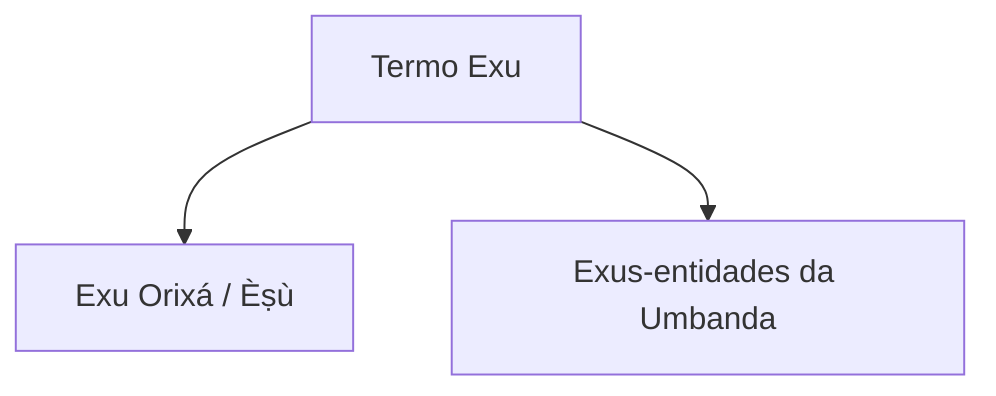

# Exu Orixá

> [!abstract] Síntese
> **Exu Orixá** é uma divindade de matriz iorubá relacionada à comunicação, circulação, movimento, mediação, troca e dinamismo ritual, entre outros campos. É indispensável distingui-lo dos [[Exus]], entidades espirituais da Umbanda. Sua identificação colonial com o Diabo cristão é uma construção histórica que não descreve adequadamente Èṣù.

## 1. A distinção fundamental

Compartilhar o nome **Exu** não torna as duas categorias idênticas.

## 2. Matriz iorubá
Èṣù possui presença profunda na religião iorubá.

Suas funções religiosas não cabem em uma tradução simples como “mensageiro”, “trickster” ou “Orixá dos caminhos”. Cada expressão ilumina apenas parte do conceito.

## 3. Comunicação
Exu é frequentemente relacionado à comunicação e à possibilidade de circulação entre agentes e domínios.

Em sistemas rituais, mediação não é função secundária: ela participa da própria possibilidade de relação.

## 4. Movimento
Exu representa dinamismo e circulação em numerosos discursos religiosos.

“Movimento” não deve ser transformado numa abstração vaga capaz de explicar qualquer acontecimento.

## 5. Caminhos
Caminhos e [[Encruzilhada|encruzilhadas]] tornaram-se símbolos centrais.

Também [[Ogum]] se relaciona a caminhos em muitos sistemas. A coincidência de um campo simbólico não significa equivalência entre Orixás.

## 6. Ordem e desordem
Exu é muitas vezes descrito por meio de ambivalência, imprevisibilidade e capacidade de produzir rearranjos.

Isso não significa que seja “mal” nem simplesmente “caótico”. A interpretação precisa partir da cosmologia em que atua.

## 7. O problema do trickster
“Trickster” é uma categoria comparativa usada em estudos de religião para figuras que atravessam fronteiras, subvertem regras ou operam ambiguidades.

Pode ajudar comparativamente, mas não é tradução de Èṣù nem substitui categorias iorubás.

## 8. Demonização
A aproximação entre Exu e o Diabo ocorreu em contextos de tradução missionária, colonialismo, cristianização e posteriormente no imaginário brasileiro.

Essa identificação produziu consequências duradouras para o preconceito contra religiões afro-brasileiras.

## 9. Exu não é Diabo
O Diabo pertence a tradições cristãs e possui história teológica própria.

Èṣù pertence a outro universo religioso.

Sincretismos e aproximações posteriores são fenômenos históricos, não identidade de origem.

## 10. Exu e moralidade
Mitos de Exu podem apresentar conflito, negociação, consequência, desejo e ambiguidade.

Não é adequado impor uma oposição cristã simplista “Orixás bons versus Exu mau”.

## 11. Exu e oferenda
Exu possui papel ritual importante em diferentes tradições afro-brasileiras.

A famosa ideia de que “Exu recebe primeiro” precisa ser estudada dentro das liturgias que efetivamente a ensinam, e não convertida em receita genérica de Umbanda.

## 12. Encruzilhada
A [[Encruzilhada]] pode representar encontro, circulação, escolha e passagem.

Reduzi-la a “lugar onde se deixa oferenda para Exu” empobrece sua densidade simbólica.

## 13. Exu e Ogum
[[Ogum]] articula ferro, trabalho, guerra e abertura de caminhos; Exu articula comunicação, mediação e circulação, entre outros campos.

Há relações míticas e rituais entre eles, mas são divindades distintas.

## 14. Exu Orixá na Umbanda
A posição de Exu Orixá varia muito.

Algumas Umbandas o reconhecem explicitamente no panteão; outras concentram a palavra Exu nas entidades guardiãs; outras elaboram modelos próprios de “irradiação” ou princípio.

## 15. Exus-entidades
[[Exus]] da Umbanda são entidades espirituais.

Podem ser compreendidos como guardiões, trabalhadores da esquerda ou por outras categorias segundo a casa.

Não é correto concluir que um Exu incorporado seja “o Orixá Exu”.

## 16. Pombagiras
[[Pombagiras]] pertencem ao universo das entidades e possuem história brasileira própria.

Não são simplesmente “Exu Orixá feminino”.

## 17. Esquerda
A categoria [[Esquerda]] organiza Exus e Pombagiras em muitas Umbandas.

Ela não deve ser projetada automaticamente sobre Èṣù na religião iorubá.

## 18. Sexualidade
Representações populares frequentemente hipersexualizam Exu e Pombagira.

Símbolos de fertilidade, potência e sexualidade precisam ser compreendidos em seus contextos religiosos, sem moralização cristã nem erotização simplista.

## 19. Exu e linguagem
Jogos de palavra, comunicação, negociação e interpretação aparecem em estudos e mitologias ligados a Exu.

Isso ajuda a compreender por que linguagem e mediação são dimensões tão relevantes.

## 20. Saudação
Saudações a Èṣù possuem formas linguísticas específicas e variantes brasileiras.

Não consolidaremos grafia ou tradução sem documentação adequada.

## 21. Cores e símbolos
Vermelho, preto, objetos de ferro e outros elementos aparecem em sistemas brasileiros, mas correspondências dependem de tradição.

## 22. Arquétipos
Astúcia, dinamismo, comunicação, capacidade de negociação e intensidade são traços às vezes usados em descrições arquetípicas.

Não constituem teste para [[Orixá de Cabeça]].

## 23. Diferenças em relação ao Candomblé
No Candomblé, Exu possui culto, assentamentos, iniciação e fundamentos próprios.

A Umbanda não deve importar procedimentos desse sistema como se fossem automaticamente seus.

## 24. Síntese teológica provisória
> **Exu é princípio divino de extraordinária complexidade ligado a comunicação, movimento e mediação, entre outros campos. Sua demonização resulta de processos históricos de tradução e conflito religioso. Na Umbanda, é indispensável separar Exu Orixá dos Exus-entidades sem ignorar que determinadas escolas constroem relações teológicas entre ambos.**

## Relações
- [[Exus]]
- [[Pombagiras]]
- [[Encruzilhada]]
- [[Ogum]]
- [[Esquerda]]
- [[Oferendas]]
- [[Orixás]]
- [[Orixá de Cabeça]]

## Questões para aprofundamento
- [ ] Etimologia e fonologia de Èṣù.
- [ ] Exu no corpus de Ifá.
- [ ] História documental da demonização.
- [ ] Exu em diferentes nações de Candomblé.
- [ ] Modelos de Exu Orixá em escolas umbandistas.
- [ ] Saudações e correspondências com fontes linguísticas.

## Camada linguística e nome
[[Èṣù]] é nome próprio da divindade. Termos como **mensageiro**, **movimento**, **comunicação**, **mediação** e **encruzilhada** descrevem funções e interpretações religiosas; não são traduções lexicais automáticas do nome Èṣù.

Essa camada deve permanecer separada de [[Exus]], categoria de entidades presente em muitas Umbandas.

## Saudações
[[Laroye|Laroyê]] e [[Mojuba|Mojubá]] precisam ser lidos separadamente. **Mojubá** possui análise lexical mais segura ligada a saudar/prestar homenagem; **Laroyê** permanece com etimologia/tradução em investigação, embora seja fórmula ritual amplamente associada a Exu no Brasil.

A existência de saudações semelhantes em diferentes contextos não elimina a distinção **Exu Orixá × Exus-entidades**.
