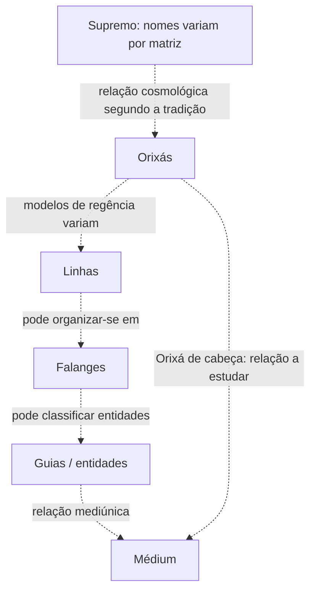

# Organização Espiritual

> [!warning]
> **Não existe uma árvore hierárquica universal da Umbanda.** Esta nota organiza problemas de estudo e modelos encontrados em diferentes escolas; não declara uma burocracia espiritual objetiva e única.

## 1. O problema
Expressões como “linha”, “falange”, “falangeiro”, “guia”, “chefe de falange”, “Orixá regente”, “guia de frente” e “Orixá de cabeça” podem parecer partes de uma única hierarquia. Na prática, seus significados e relações variam entre autores, escolas e terreiros.

## 2. Categorias que não devem ser fundidas
### Divindade suprema
Nomes como [[Olorum]], [[Olodumare]] e [[Zambi]] pertencem a matrizes culturais distintas e podem ser usados por Umbandas para falar do Supremo.

### Orixás
[[Orixás]] pertencem a uma categoria diferente de espíritos incorporantes. A forma de compreendê-los — divindades, potências, forças, irradiações etc. — varia por escola.

### Linhas e falanges
[[Linhas e Falanges]] são modelos de classificação/organização espiritual. Seu significado não é uniforme.

### Guias espirituais
[[Guias Espirituais]] são entidades que trabalham nas categorias reconhecidas pela casa, como [[Caboclos]], [[Pretos-Velhos]], [[Crianças]], [[Exus]] e outras.

### Médium
O [[Médium]] participa da relação mediúnica; não deve ser colocado simplesmente como “último degrau” de uma cadeia administrativa.

## 3. Hierarquia × função × relação
Três relações precisam ser distinguidas:

**hierárquica** — um sistema afirma subordinação ou chefia;

**funcional** — categorias cumprem funções diferentes sem necessariamente implicar superioridade;

**mediúnica** — descreve relação entre entidade/Orixá e médium, como [[Guia de Frente]] ou [[Orixá de Cabeça]].

Confundir essas relações produz diagramas aparentemente claros, porém teologicamente frágeis.

## 4. Modelo didático provisório

> [!important]
> As setas representam **questões e modelos de estudo**, não uma hierarquia universal comprovada.

## 5. Orixá e linha
Algumas escolas organizam linhas sob regência de Orixás. Outras utilizam sete linhas com composições diferentes; outras ainda não dependem de uma tabela fixa de sete.

Por isso, “Linha de Xangô”, por exemplo, só pode ser interpretada adequadamente conhecendo o sistema da casa ou do autor.

## 6. Linha e falange
Em determinados modelos, linha é categoria mais ampla e falange uma subdivisão. Em outros, os termos recebem usos menos rígidos.

Ver [[Linha]] e [[Falange]].

## 7. Falange e falangeiro
[[Falangeiro]] pode designar espírito pertencente ou relacionado a uma falange. Algumas escolas também falam em chefes de falange e nomes coletivos.

Isso não autoriza concluir que todo nome repetido por entidades corresponda ao mesmo indivíduo espiritual.

## 8. Guia
“Guia” pode significar entidade espiritual que acompanha/trabalha com um médium, mas o vocabulário varia. Também existe “guia” como fio de contas em contextos rituais; são conceitos diferentes.

## 9. Guia de Frente
[[Guia de Frente]] é uma relação/função mediúnica em determinadas Umbandas, não um nível cosmológico universal.

A forma de reconhecer essa função pertence ao desenvolvimento e à orientação do terreiro.

## 10. Orixá de Cabeça
[[Orixá de Cabeça]] também descreve relação religiosa entre pessoa e Orixá conforme determinado sistema.

Não deve aparecer abaixo ou acima do médium como se fosse cargo administrativo.

## 11. Entidade × arquétipo × nome de trabalho
Uma entidade pode apresentar-se por nome religioso que também aparece em outras casas ou médiuns. Isso levanta questões sobre identidade individual, falange, nome de trabalho e arquétipo.

O projeto não resolverá essa questão por pressuposto.

## 12. Direita e esquerda
[[Direita]] e [[Esquerda]] são categorias presentes em muitas Umbandas, mas seus sentidos variam. Não equivalem automaticamente a “bem × mal”.

## 13. Relações a documentar
- [[Linha]]
- [[Falange]]
- [[Falangeiro]]
- [[Guias Espirituais]]
- [[Guia de Frente]]
- [[Orixá de Cabeça]]
- [[Médium]]
- [[Incorporação]]
- [[Direita]]
- [[Esquerda]]

## 14. Questões abertas
- [ ] Comparar modelos históricos das Sete Linhas.
- [ ] Mapear modelos contemporâneos por escola/autoria.
- [ ] Investigar “chefe de falange” e nomes coletivos.
- [ ] Separar terminologia do terreiro do estudante das sistematizações bibliográficas.
- [ ] Construir mapas comparativos sem fundir modelos incompatíveis.
