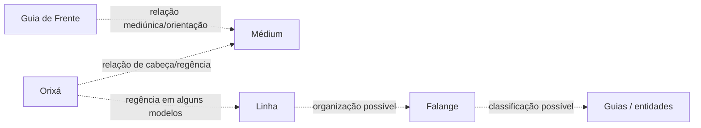

# Orixá de Cabeça — Relação Organizacional

> [!info]
> A nota principal sobre experiência, identificação e desenvolvimento permanece em [[Orixá de Cabeça]], na área de **Mediunidade**. Esta nota trata somente da posição conceitual dessa relação dentro dos modelos de organização espiritual.

## 1. Relação, não degrau
Orixá de Cabeça não deve ser representado como nível entre Orixá e médium.

É uma **relação religiosa atribuída entre uma pessoa e um Orixá**, cuja definição varia por escola.

## 2. Modelo relacional

As duas setas que chegam ao médium não representam funções equivalentes.

## 3. Orixá de Cabeça × Guia de Frente
[[Orixá de Cabeça]] pertence à relação pessoa–Orixá.

[[Guia de Frente]] pertence à relação médium–entidade em escolas que utilizam esse conceito.

Uma relação não permite deduzir automaticamente a outra.

## 4. Orixá de Cabeça × linha
Algumas doutrinas aproximam a linha principal de trabalho do médium do seu Orixá de Cabeça. Outras não estabelecem correspondência rígida.

## 5. Orixá de Cabeça × coroa
[[Coroa Mediúnica]] pode englobar diferentes relações conforme a casa. “Coroa”, “cabeça”, “frente”, “juntó” e “adjunto” não serão fundidos sem fonte.

## 6. Onde estudar cada aspecto
- experiência e desenvolvimento → [[Orixá de Cabeça]];
- sistema de Orixás → [[Orixás]];
- posição relacional → esta nota;
- linhas/falanges → [[Linhas e Falanges]];
- relação com entidade principal → [[Guia de Frente]].

## Questões abertas
- [ ] Comparar modelos organizacionais por escola.
- [ ] Verificar quando “regência” significa relação pessoal e quando significa linha.
- [ ] Construir diagramas separados para modelos documentados.
