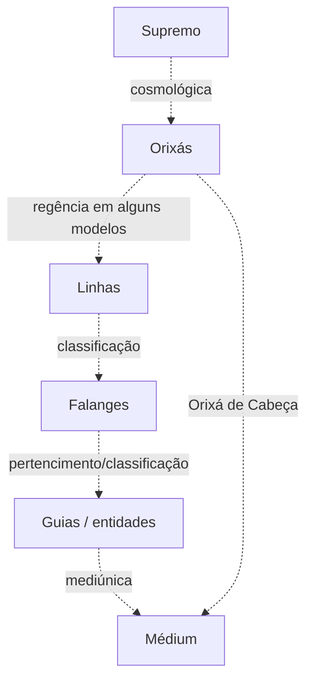

# Relações Espirituais

> [!warning]
> Este mapa distingue **tipos de relação**. Não afirma uma hierarquia universal.

## Tipos de relação
**Cosmológica** — relação entre Supremo, divindades e mundo segundo determinada teologia.

**Organizacional** — linha, falange, povo, legião ou categorias equivalentes.

**Funcional** — campo de trabalho ou função sem implicar superioridade.

**Mediúnica** — relação de entidade com médium.

**Pessoal com Orixá** — conceitos como [[Orixá de Cabeça]] conforme a tradição.

## Regra de leitura
Uma seta só deve tornar-se contínua/afirmativa em mapa de uma escola quando a fonte daquela escola estabelecer a relação.

## Relações
- [[Organização Espiritual]]
- [[Orixá de Cabeça - Relação Organizacional]]
- [[Guia]]
- [[Guia de Frente]]
- [[Linhas e Falanges]]
