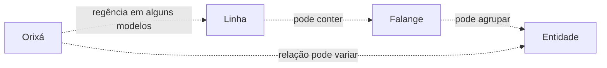

# Linhas e Falanges

> [!abstract]
> **Linha** e **falange** são termos usados para organizar/classificar campos de atuação, conjuntos de entidades e relações religiosas na Umbanda. Não existe uma taxonomia única compartilhada por todos os terreiros.

## 1. Por que estudar separadamente
Falar apenas “Caboclo é uma linha” ou “entidade X pertence à falange Y” pode ocultar que diferentes escolas usam os mesmos termos de maneiras distintas.

O projeto estudará primeiro os conceitos e depois os modelos particulares.

## 2. Linha
Em sentido geral, **linha** pode designar uma categoria ampla de trabalho ou organização espiritual.

Dependendo da tradição, uma linha pode ser definida por:
- Orixá/regência;
- categoria de entidades;
- campo de atuação;
- modelo doutrinário da escola;
- combinação desses critérios.

Ver [[Linha]].

## 3. Falange
**Falange** costuma indicar agrupamento mais específico dentro de uma organização espiritual, mas essa relação não é universalmente padronizada.

Ver [[04 - Linhas e Falanges/Falange|Falange]].

## 4. Falangeiro
[[04 - Linhas e Falanges/Falangeiro|Falangeiro]] pode designar entidade integrante de determinada falange.

O termo não prova sozinho que exista uma cadeia hierárquica objetiva com estrutura idêntica à militar.

## 5. Nomes coletivos
Nomes como “Caboclo X”, “Exu Y” ou “Preto-Velho Z” podem, em determinadas interpretações, funcionar como nomes de trabalho ou referências a falanges, e não necessariamente como identificação civil de uma única personalidade desencarnada.

Isso varia por escola e precisa de fonte.

## 6. As Sete Linhas
A ideia das **Sete Linhas da Umbanda** é historicamente importante, mas diferentes autores preencheram essas sete linhas de maneiras diferentes.

Portanto:

> **“Sete Linhas” é uma família de modelos, não uma tabela universal única.**

Uma etapa posterior comparará sistemas históricos e contemporâneos lado a lado.

## 7. Linhas de Orixá
Algumas Umbandas falam em Linha de Oxalá, Ogum, Oxóssi, Xangô etc. A quantidade, composição e relação entre essas linhas variam.

Regência não deve ser entendida automaticamente como “Orixá comandando espíritos” de forma administrativa.

## 8. Linhas de entidades
Também se fala em linhas/categorias como:
- [[Caboclos]];
- [[Pretos-Velhos]];
- [[Crianças]];
- [[Boiadeiros]];
- [[Baianos]];
- [[Marinheiros]];
- [[Malandros]];
- [[Ciganos]];
- [[Exus]];
- [[Pombagiras]];
- [[Linha do Oriente]].

Dependendo do sistema, algumas dessas categorias podem ser chamadas linhas, povos, falanges ou sublinhas.

## 9. Caboclos
[[Caboclos]] podem ser organizados por nomes de falange, relações com Orixás, campos simbólicos ou fundamentos da casa.

Não existe uma tabela única Caboclo → Orixá válida para toda Umbanda.

## 10. Pretos-Velhos
O mesmo vale para [[Pretos-Velhos]]. Nomes como Pai, Vovô/Vovó, Tia/Tio e referências regionais ou religiosas podem participar da construção de nomes de trabalho e falanges.

## 11. Exus e Pombagiras
[[Exus]] e [[Pombagiras]] exigem atenção especial porque modelos de esquerda, guardiões, povos, reinos e falanges variam fortemente.

Não serão importadas tabelas de Quimbanda para a Umbanda sem identificar a tradição.

## 12. Linha do Oriente
[[Linha do Oriente]] é exemplo particularmente útil para observar sistemas que combinam categorias espirituais, imaginários culturais, Espiritismo, esoterismo e formulações próprias de determinadas Umbandas.

## 13. Linha × Orixá × entidade

> [!warning]
> Este diagrama representa **um modelo recorrente possível**, não a estrutura universal da Umbanda.

## 14. Critérios para registrar uma falange
Ao criar uma nota de falange, registrar quando possível:
1. nome e variantes;
2. escola/terreiro/autor que utiliza a classificação;
3. categoria espiritual relacionada;
4. Orixá ou linha associada, quando a fonte estabelecer;
5. função/campo de trabalho atribuído;
6. entidades/nomenclaturas relacionadas;
7. símbolos ou elementos rituais;
8. divergências;
9. fontes.

## 15. O que evitar
Evitar transformar listas de internet em organogramas religiosos; deduzir falange pelo nome da entidade; atribuir Orixá automaticamente; tratar “chefe de falange” como fato universal; ou misturar sistemas de autores diferentes numa única árvore.

## 16. Relações
- [[Organização Espiritual]]
- [[Linha]]
- [[04 - Linhas e Falanges/Falange|Falange]]
- [[04 - Linhas e Falanges/Falangeiro|Falangeiro]]
- [[Guias Espirituais]]
- [[Orixás]]
- [[Direita]]
- [[Esquerda]]

## 17. Próxima camada de pesquisa
- [ ] História das Sete Linhas.
- [ ] Modelos de Leal de Souza e outros autores históricos.
- [ ] Modelos posteriores e contemporâneos.
- [ ] Comparação entre linha, povo, falange, legião e corrente.
- [ ] Modelos específicos do terreiro do estudante, quando voluntariamente documentados.
