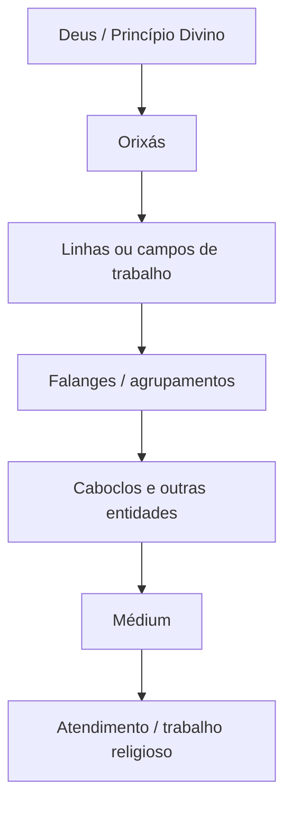

# Caboclos

> [!abstract] Síntese
> Na Umbanda, **Caboclos são entidades espirituais**, e não Orixás. Constituem uma das formas centrais de apresentação dos guias em muitas tradições umbandistas e mobilizam uma linguagem religiosa ligada à ancestralidade indígena e brasileira, à terra, à natureza, à força, à liberdade, ao conhecimento e ao trabalho espiritual. A categoria não possui interpretação única: identidade espiritual, relação com Orixás, falanges e formas de manifestação variam entre vertentes e terreiros.

## 1. Caboclo não é Orixá

Esta distinção é fundamental para quem começa.

Na maior parte das formulações umbandistas, [[Orixás]] e Caboclos pertencem a categorias religiosas diferentes. Orixás são compreendidos de modos diversos pelas escolas — como divindades, potências divinas, forças ou princípios da criação, irradiações do sagrado etc. — enquanto Caboclos são compreendidos como **entidades espirituais que trabalham religiosamente e podem manifestar-se mediunicamente**.

Assim, [[Oxóssi]] não é simplesmente “um Caboclo”. Uma casa pode compreender determinado Caboclo como trabalhando na linha ou irradiação de Oxóssi; outra pode organizar essa relação de modo diferente.

Uma representação apenas didática é:

> [!warning]
> O diagrama é **pedagógico e provisório**. Não representa uma hierarquia universal da Umbanda.

## 2. O que significa “Caboclo” dentro da religião?

Fora da Umbanda, **caboclo** possui história social, étnica e regional complexa no Brasil. O uso religioso não deve ser reduzido à definição de um dicionário civil ou histórico.

No campo umbandista, Caboclo tornou-se uma categoria própria de entidade. Para este projeto, uma definição inicial útil é:

> **Caboclo é uma entidade espiritual da Umbanda que se apresenta dentro de uma linguagem religiosa fortemente relacionada à ancestralidade indígena e brasileira, à natureza, à força, ao conhecimento e a determinados campos de trabalho espiritual, sem que isso estabeleça uma biografia ou função universal para todos os Caboclos.**

## 3. O Caboclo foi necessariamente indígena em vida?

Não existe resposta universal.

Há tradições que interpretam Caboclos como espíritos de pessoas indígenas ou profundamente ligadas aos povos originários. Outras entendem “Caboclo” principalmente como **identidade ou forma espiritual de trabalho**. Há ainda formulações intermediárias.

Por isso, **nome espiritual, aparência ritual e arquétipo não constituem automaticamente uma biografia verificável do espírito**.

## 4. Arquétipo e linguagem religiosa

A palavra **arquétipo** pode ser útil didaticamente, desde que não seja usada para negar a realidade espiritual afirmada pela tradição.

A manifestação dos Caboclos frequentemente mobiliza atributos como força, firmeza, coragem, direção, liberdade, conhecimento, mata, ervas, cura, proteção e orientação.

Isso não significa que todo Caboclo apresente todos esses atributos. Uma entidade pode trabalhar especialmente com ervas; outra com aconselhamento; outra com proteção, descarrego, justiça ou caminhos, conforme a tradição.

## 5. Ancestralidade indígena

A presença dos Caboclos introduz uma dimensão indígena fundamental no universo umbandista.

Duas afirmações precisam permanecer juntas:

1. a ancestralidade indígena possui importância real na construção religiosa da figura do Caboclo;
2. **Caboclo de Umbanda não representa automaticamente povos indígenas reais, suas cosmologias ou suas religiões.**

O Brasil possui grande diversidade de povos, línguas, histórias e cosmologias indígenas. Reduzir tudo isso a “índio da mata com arco e flecha” produz um estereótipo.

## 6. Mata, território e natureza

Em muitas tradições, a mata aparece como grande campo simbólico dos Caboclos.

Nesse contexto, **mata** pode significar mais do que ambiente geográfico. Território, folhas, árvores, águas, pedras e outros elementos naturais podem possuir valor simbólico e ritual.

Isso ajuda a compreender por que [[Ervas]], [[Benzimento]], [[Defumação]] e determinados Orixás aparecem frequentemente ligados ao estudo dos Caboclos.

A associação “Caboclo = mata”, entretanto, não deve virar regra absoluta.

## 7. Nomes de Caboclos

A tradição apresenta muitos nomes de trabalho, como Sete Flechas, Pena Branca, Tupinambá, Cobra Coral, Rompe-Mato e outros, além de Caboclas como Jurema e outras denominações conforme a casa.

O iniciante não deve pressupor que um nome de entidade funcione necessariamente como **nome civil individual**.

Em determinadas escolas, o mesmo nome pode relacionar-se a uma [[Falange]] ou família espiritual. Em outras, a interpretação é diferente. Encontrar o mesmo nome em médiuns distintos não resolve, por si só, a identidade espiritual envolvida.

## 8. Falanges de Caboclos

[[Falange]] é conceito importante, mas não universalmente padronizado.

Em muitas sistematizações, falange é agrupamento de entidades relacionadas por identidade, campo de atuação, direção ou afinidade espiritual. Outras escolas usam estruturas com linha, legião, falange e subfalange; outras não adotam esse organograma.

> [!important]
> Não devemos construir uma “administração oficial do plano espiritual” juntando diagramas de autores diferentes. Cada modelo precisa permanecer ligado à sua fonte.

## 9. Caboclos e Orixás

É comum encontrar relações entre Caboclos e [[Orixás]], mas elas precisam ser contextualizadas.

Uma casa pode dizer que determinado Caboclo trabalha na linha de [[Oxóssi]]. Isso não significa Caboclo = Oxóssi.

Em algumas sistematizações, Oxóssi aparece ligado a mata, conhecimento e expansão; Ogum a caminhos e movimento; Xangô a justiça; Oxalá a fé ou elevação. **Essas correspondências não serão tratadas como tabela universal.**

## 10. Incorporação

Caboclos podem manifestar-se por meio da [[Incorporação]].

A linguagem “o espírito entra no corpo” é simplificada demais para abranger todas as explicações existentes. Escolas e autores podem falar em incorporação, sintonia, irradiação, acoplamento, aproximação fluídica e outros modelos.

Incorporação também não implica necessariamente inconsciência. Existem diferentes doutrinas e relatos sobre graus de consciência mediúnica.

Para o iniciante, sensações corporais isoladas não devem ser transformadas imediatamente em identificação definitiva de entidade.

## 11. Linguagem corporal

Em determinadas giras, Caboclos apresentam postura firme, movimentos dos braços, brados e gestos relacionados simbolicamente a flechas, mata, direção ou força.

Esses comportamentos participam da linguagem ritual, mas **não são checklist diagnóstico**. O médium iniciante não precisa imitar manifestações observadas em outros médiuns.

## 12. Ervas

A relação entre Caboclos e [[Ervas]] é recorrente. Podem aparecer associados a banhos, [[Defumação]], [[Amaci]], benzimentos, folhas, ramos e outros usos rituais.

É indispensável separar:

**uso ritual de uma planta ≠ segurança medicinal ou farmacológica.**

Uma erva utilizada religiosamente não é automaticamente segura para ingestão ou adequada a qualquer pessoa.

## 13. Cura

“Cura” em contexto religioso pode ter sentido diferente de cura clínica.

Uma tradição pode falar em cura espiritual para oração, passe, benzimento, aconselhamento, fortalecimento ou limpeza ritual. Isso não autoriza substituir diagnóstico ou tratamento médico.

Neste projeto distinguiremos **afirmação religiosa, experiência subjetiva, tradição do terreiro e evidência médica/científica**.

## 14. Pontos cantados

[[Ponto Cantado]] é canto ritual.

Pontos de Caboclos podem mobilizar imagens de mata, flecha, folhas, rios, Jurema, Orixás e nomes de entidades. Além da função ritual, podem ser fontes para estudar linguagem religiosa e memória coletiva.

Um ponto isolado, porém, não deve ser tratado como tratado doutrinário universal.

## 15. Pontos riscados

Em determinadas tradições, Caboclos podem utilizar [[Ponto Riscado]], frequentemente com [[Pemba]].

A interpretação depende do fundamento da casa. Não é seguro encontrar um desenho na internet e concluir que determinado símbolo identifica universalmente uma entidade.

## 16. Jurema

**Jurema** pode designar plantas, referência simbólica à mata, nomes de entidades como Cabocla Jurema e tradições religiosas próprias, como a Jurema Sagrada.

Há cruzamentos históricos importantes, mas os sentidos não são equivalentes automaticamente. A futura nota [[Jurema]] deverá separá-los.

## 17. Existe hierarquia entre Caboclos?

Depende da escola.

Termos como chefe de terreiro, guia-chefe, chefe de falange, linha, legião, falange e subfalange aparecem em diferentes sistemas. Não existe estrutura administrativa única aceita por todas as Umbandas.

Quando estudarmos um modelo hierárquico, ele será identificado como **modelo de determinada escola, autor ou terreiro**.

## 18. Caboclos são “espíritos mais evoluídos”?

A ideia de [[Evolução Espiritual]] é importante em determinadas Umbandas, especialmente nas influenciadas pelo Espiritismo.

Outras leituras enfatizam ancestralidade, função e fundamento em vez de escalas rígidas. Assim, afirmações como “Caboclo está acima de Exu” não serão universalizadas.

## 19. Caboclo e Preto-Velho

[[Caboclos]] e [[Pretos-Velhos]] são categorias centrais, mas mobilizam linguagens simbólicas distintas.

Didaticamente, Caboclos são frequentemente relacionados a força, direção, liberdade, natureza e ancestralidade indígena; Pretos-Velhos, a ancestralidade negra, memória, experiência, paciência, aconselhamento e resistência.

Isso não significa que Caboclo não tenha acolhimento nem que Preto-Velho não tenha força. São tendências simbólicas, não limites.

## 20. Caboclos, Boiadeiros e outras categorias

[[Boiadeiros]], [[Baianos]], [[Marinheiros]] e outras entidades recebem classificações diferentes. Algumas tradições aproximam determinados grupos dos Caboclos; outras os organizam como linhas ou povos próprios.

Por isso o projeto não adotará prematuramente uma árvore única de linhas e falanges.

## 21. O iniciante e a descoberta do próprio Caboclo

Durante o desenvolvimento, é comum querer descobrir imediatamente nome, falange, Orixá relacionado, ponto cantado, ponto riscado, ervas e função.

Essas respostas não precisam ser aceleradas.

Sensações, imagens mentais, nomes e movimentos podem ser registrados no [[Desenvolvimento Mediúnico|Caderno de Desenvolvimento]], mas não precisam virar certeza imediata. A orientação do terreiro e a consistência ao longo do desenvolvimento têm precedência sobre listas da internet.

## 22. Síntese teológica provisória

> **Caboclo é uma entidade espiritual central em muitas Umbandas, cuja identidade religiosa mobiliza de forma especialmente forte ancestralidade indígena/brasileira, natureza, liberdade, força e conhecimento. Atua dentro de sistemas de linhas e falanges que variam entre tradições e pode relacionar-se a Orixás sem se confundir com eles. Sua manifestação, seus símbolos e seus campos de trabalho devem ser compreendidos no fundamento da casa e não por estereótipos ou tabelas universais.**

## 23. Linhas de pesquisa

Para amadurecer esta nota, a pesquisa histórica e antropológica deve investigar a formação da categoria Caboclo, as memórias indígenas reelaboradas religiosamente, relações com outras tradições brasileiras e variações regionais.

A pesquisa acadêmica pode descrever história, representações e práticas. Ela **não decide**, por método científico, se uma entidade espiritual existe ou qual é sua natureza metafísica; essa questão pertence ao campo da crença e da teologia religiosa.

## Saudação
Não existe uma única saudação obrigatória para todos os Caboclos. Entre aclamações registradas em contextos de terreiro aparecem **“Okê, Caboclo!”**, **“Okê, Caboco!”** e formas simples como **“Salve os Caboclos!”**.

“Okê” também aparece em saudações relacionadas a [[Oxóssi]], o que ajuda a explicar sua circulação em contextos de Caboclos ligados às matas. Isso não significa que Caboclo e Oxóssi sejam a mesma categoria.

> [!note]
> A forma usada pelo terreiro deve prevalecer. Grafia, pronúncia e associação podem variar por região e tradição.

## Relações

- [[Orixás]]
- [[Oxóssi]]
- [[Falange]]
- [[Linhas e Falanges]]
- [[Guias Espirituais]]
- [[Pretos-Velhos]]
- [[Boiadeiros]]
- [[Ervas]]
- [[Benzimento]]
- [[Defumação]]
- [[Amaci]]
- [[Ponto Cantado]]
- [[Ponto Riscado]]
- [[Pemba]]
- [[Incorporação]]
- [[Jurema]]

## Questões para aprofundamento

- [ ] Comparar a teologia dos Caboclos em autores umbandistas de vertentes diferentes.
- [ ] Estudar historicamente as relações entre Caboclo, Encantado e Jurema.
- [ ] Mapear modelos de falanges sem fundi-los em sistema artificial.
- [ ] Estudar Caboclos–Oxóssi em diferentes escolas.
- [ ] Registrar pontos cantados com origem e contexto identificáveis.
- [ ] Integrar os livros da biblioteca pessoal do projeto.
