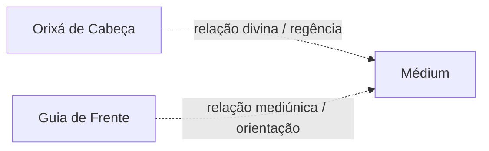

# Guia de Frente

> [!abstract] Síntese
> **Guia de Frente** é uma expressão usada em determinadas Umbandas para designar uma entidade que ocupa relação de destaque na orientação ou no trabalho mediúnico de uma pessoa. O conceito não possui definição universal e pode ser confundido com guia-chefe, mentor, chefe de coroa ou outras categorias.

## 1. Guia de Frente é entidade

Diferentemente de [[Orixá de Cabeça]], Guia de Frente é entendido, nas tradições que utilizam o termo, como **entidade espiritual**.

Essa distinção é central:

> [!warning]
> O esquema apenas distingue tipos de relação. Não define uma teologia universal.

## 2. O que significa “de frente”?

Pode indicar entidade que atua de forma central no desenvolvimento ou trabalho do médium.

Em algumas casas pode ser o guia que “responde” pela coroa; em outras, o guia principal de determinada linha; em outras, o termo não é utilizado.

## 3. Guia de Frente × guia-chefe

Algumas tradições tratam os termos como equivalentes.

Outras distinguem:

- guia principal do médium;
- guia-chefe da corrente;
- entidade-chefe do terreiro;
- chefe de falange.

Essas categorias não devem ser misturadas.

## 4. Linha do Guia de Frente

O Guia de Frente pode ser apresentado como Caboclo, Preto-Velho ou outra entidade, dependendo da tradição.

Não existe regra universal de que necessariamente seja Caboclo ou pertença a uma linha específica.

## 5. Relação com Orixá de Cabeça

Algumas escolas relacionam a linha do Guia de Frente ao [[Orixá de Cabeça]].

Outras não estabelecem correspondência direta.

Portanto, saber o nome de um guia não permite determinar automaticamente o Orixá de Cabeça.

## 6. Como é identificado?

Métodos variam:

- desenvolvimento mediúnico;
- orientação do dirigente;
- confirmação ritual;
- tradição interna da casa;
- outros critérios próprios.

Um nome surgido em experiência inicial não precisa ser aceito imediatamente como confirmação.

## 7. Pressa e expectativa

O iniciante pode querer descobrir rapidamente:

- nome;
- falange;
- linha;
- Orixá relacionado;
- função;
- ponto riscado.

Essa ansiedade pode interferir na percepção.

O desenvolvimento deve priorizar estabilidade antes de identificação.

## 8. Guia de Frente e autoridade

Mesmo quando uma entidade é reconhecida como Guia de Frente, isso não significa que tudo atribuído a ela seja autoridade absoluta fora do contexto religioso.

Ética, responsabilidade e discernimento permanecem necessários.

## 9. Síntese

> **Guia de Frente é uma categoria mediúnica e organizacional usada por determinadas Umbandas para uma entidade de destaque na relação com o médium. Não é Orixá de Cabeça e não possui definição ou método de identificação universal.**

## Relações
- [[Médium]]
- [[Guias Espirituais]]
- [[Orixá de Cabeça]]
- [[Incorporação]]
- [[Falange]]
- [[Coroa Mediúnica]]

## Questões para aprofundamento
- [ ] Comparar guia de frente, guia-chefe e mentor.
- [ ] Verificar quais linhas podem ocupar essa função por tradição.
- [ ] Estudar relação com coroa mediúnica.
- [ ] Mapear critérios de confirmação sem criar método genérico.
