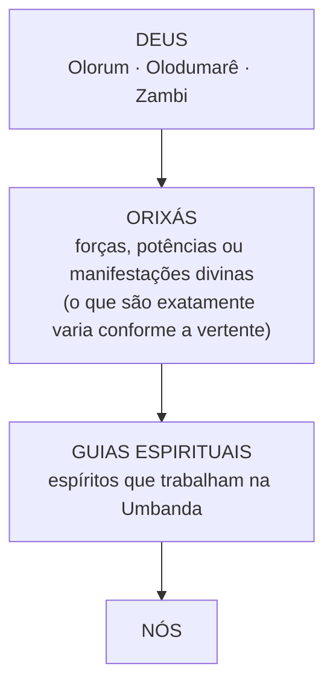

	
# Módulo 1 — Aula 4 — Deus nas diferentes concepções umbandistas

## 1. Objetivo

Ao terminar esta aula, quero que você consiga responder com tranquilidade a quatro perguntas:

1. Qual é, em linhas gerais, o **lugar de Deus** na Umbanda?
2. Por que você vai ouvir nomes como **Deus, Olorum, Olodumarê, Zambi**, e de onde eles vêm?
3. Por que **Deus, Orixá e guia espiritual** são coisas diferentes?
4. Por que **nenhum nome e nenhum esquema** deve ser tratado como a definição oficial de toda a Umbanda?

Pergunta central da aula:

> **Se a Umbanda crê em um Deus único, por que cultua Orixás e trabalha com guias?**

Vamos chegar lá aos poucos.

## 2. Conceitos prévios

Antes de começar, é bom ter claro o que vimos nas aulas anteriores:

- a Umbanda é uma religião **formada no Brasil**, a partir de várias matrizes (africanas, indígenas, católica, espírita), e **não tem uma autoridade doutrinária única** ([[M01 - A01 - O que é Umbanda|Aula 1]] e [[M01 - A03 - Características fundamentais da religião|Aula 3]]);
- a própria palavra "Umbanda" já carrega essa mistura de heranças ([[M01 - A02 - Origem e significado do termo Umbanda|Aula 2]]);
- **Orixá ≠ entidade incorporante** (Aula 3).

Se algum desses pontos ainda estiver nebuloso, vale reler antes. Vamos usar os três o tempo todo.

## 3. Conteúdo

### Existe um Deus na Umbanda?

De maneira ampla, **sim**.

Praticamente todas as Umbandas reconhecem um **princípio divino supremo**, criador de tudo e acima de tudo. No dia a dia do terreiro, a maioria das pessoas simplesmente diz: **Deus**.

Só que, conforme você conhecer outros terreiros, livros e escolas, vai encontrar outros nomes. E aqui entra uma regra que vai acompanhar o curso inteiro:

> **Nomes usados como equivalentes na Umbanda não têm necessariamente a mesma origem nem o mesmo significado nas tradições de onde vieram.**

Vamos ver isso nome por nome.

### Olorum e Olodumarê: a matriz iorubá

Os dois nomes vêm da tradição religiosa **iorubá**, dos povos da região que hoje é principalmente o sudoeste da Nigéria e partes do Benim.

- **Olorum** (iorubá *Ọlọ́run*) costuma ser traduzido como algo próximo de **"senhor" ou "dono do céu"**. *Òrun* é o céu, o plano espiritual. É uma tradução corrente, mas trate a etimologia com cautela: veremos isso no [[Olorum|verbete do Dicionário]].
- **Olodumarê** (*Olódùmarè*) é outra denominação tradicional do Ser Supremo iorubá. Sua etimologia é **debatida**.

Um detalhe interessante: segundo pesquisadores como Pierre Verger e Reginaldo Prandi, na tradição iorubá o Ser Supremo, em muitas descrições, **não recebe culto direto** como os Orixás recebem. A relação do dia a dia com o sagrado passa pelos Orixás, pelos ancestrais e pelo **axé**.

Por isso, seria inadequado pensar:

> ❌ "Olorum é simplesmente a palavra umbandista para Deus."

Não exatamente. Quando um terreiro chama Deus de Olorum, está **adotando e reelaborando** um termo africano dentro de uma religião brasileira. Isso não quer dizer que toda a cosmologia iorubá tenha vindo junto.

### Zambi: a matriz banta

Agora mudamos de matriz.

**Zambi** vem das tradições dos povos de **línguas bantas** da África Centro-Ocidental (regiões do Congo e de Angola). Você vai encontrar formas como:

- Zambi, Zâmbi;
- Nzambi;
- Nzambi a Mpungu;
- Zambiapongo.

Preste atenção quando os **Pretos-Velhos** falarem: é muito comum ouvi-los dizer "Zambi". É uma marca da herança banta na Umbanda.

Então perceba: **Olorum e Zambi não são duas palavras que a Umbanda inventou para a mesma coisa.** Vêm de povos, línguas e religiões africanas diferentes. No Brasil, passaram a ser usadas para expressar a mesma ideia de um Deus supremo.

### E Tupã?

Às vezes você vai ouvir **Tupã** como nome de Deus. Aqui cabe uma nota histórica: entre os povos tupis, Tupã estava ligado ao **trovão**. Foram principalmente os **jesuítas**, na catequese colonial, que usaram "Tupã" para traduzir o Deus cristão.

Isso não torna errado o uso religioso do nome. Mas é bom saber que não se trata de uma "teologia indígena original" transmitida intacta.

### Então qual nome é o correto?

**Não existe um único nome obrigatório para toda a Umbanda.**

- Um terreiro fala predominantemente **Deus**.
- Outro fala **Olorum**.
- Outro fala **Zambi**.
- Muitos usam **mais de um**, conforme o momento, o ponto cantado ou a entidade que fala.

Uma escola teológica pode preferir um nome e construir toda a sua explicação em torno dele. Isso não é contradição. É consequência direta da **formação plural** da Umbanda, que você estudou nas Aulas 1 a 3.

### Deus e os Orixás

Chegamos a uma distinção fundamental. Apenas como **modelo didático inicial**, muitas concepções umbandistas poderiam ser desenhadas assim:

**Não transforme esse desenho em hierarquia universal.** Ele serve para mostrar uma ideia muito difundida: **Deus é o princípio supremo**, e os Orixás participam da manifestação ou da ordenação da criação.

A pergunta "o que é um Orixá?" recebe respostas diferentes. Algumas casas falam em **forças da natureza**, outras em **potências divinas**. Algumas escolas usam **irradiações de Deus, qualidades divinas, mistérios, vibrações**. Essas diferenças não são só de palavras: podem representar sistemas teológicos distintos. Vamos estudar isso na próxima aula.

Por enquanto, guarde:

> **Orixá não é sinônimo de Deus. E também não é simplesmente "um espírito muito evoluído".**

### Se existe um Deus supremo, por que cultuar Orixás e trabalhar com guias?

É uma das melhores perguntas que um iniciante pode fazer.

Uma resposta muito comum na Umbanda é: **reconhecer um Deus supremo não elimina outras relações com o sagrado.** Os Orixás e os guias não competem com Deus. Ocupam **outros lugares** na relação religiosa.

Veja as três categorias lado a lado:

| | O que é | Exemplo |
|---|---|---|
| **Deus** | Princípio divino supremo | Deus, Olorum, Zambi |
| **Orixá** | Divindade: força, potência ou manifestação divina (conforme a vertente) | Ogum, Oxóssi, Iemanjá |
| **Guia / entidade** | Espírito que trabalha na gira | Caboclo, Preto-Velho, Criança |

Daí saem algumas consequências importantes:

- **Oxóssi não é um Caboclo.** Um Caboclo que trabalha na linha de Oxóssi é um espírito que trabalha nessa irradiação. Não é o Orixá.
- **Xangô não é um Preto-Velho.**
- **Deus não é "o Orixá mais poderoso".**

São **categorias religiosas diferentes**. Isso vai ser a base de muitas aulas.

*(Uma ressalva: em algumas vertentes, como as de maior influência do Candomblé, o próprio Orixá pode se manifestar no médium. Mas mesmo lá Orixá e guia continuam sendo categorias diferentes.)*

### E Oxalá? Oxalá é Deus?

Essa é uma confusão muito comum, e vale entender **de onde ela vem**.

No processo histórico de **sincretismo**, Oxalá foi fortemente associado a **Jesus Cristo** (na Bahia, ao Senhor do Bonfim). E, no cristianismo, Jesus tem uma relação teológica própria com Deus. Então a cabeça faz uma cadeia:

> Oxalá → Jesus → Deus → logo, **Oxalá = Deus**

Mas essa cadeia **mistura sistemas religiosos diferentes**.

Na quase totalidade das concepções umbandistas, **Oxalá é um Orixá**, ainda que colocado em posição muito elevada e ligado à fé, à criação e à paz. **Deus continua sendo o princípio supremo.** Vamos estudar Oxalá individualmente no Módulo 10.

### Deus tem forma humana?

Aqui começamos a entrar no campo das interpretações.

Muitas Umbandas **não** entendem Deus como um homem sentado em algum lugar do céu. É comum ouvir Deus descrito como:

- **inteligência suprema**;
- **princípio criador**;
- **fonte da vida**;
- **consciência divina**;
- **força que está em tudo**.

Parte desse vocabulário vem do **Espiritismo**. Em *O Livro dos Espíritos* (1857), logo na questão 1, Allan Kardec define:

> "Deus é a inteligência suprema, causa primária de todas as coisas."

Nas Umbandas de forte influência kardecista, essa definição é muito presente. Já o **catolicismo popular** trouxe a imagem de Deus como **Pai** que ouve, protege e perdoa, e ela convive tranquilamente com a anterior em muitos terreiros.

Algumas **escolas umbandistas** construíram vocabulários próprios. A **Umbanda Sagrada** (Rubens Saraceni), por exemplo, fala em **Olorum, o Divino Criador**, e entende os Orixás como **qualidades divinas** e **mistérios** manifestados por Ele: emanações de Olorum que sustentam a criação. *(Livro da biblioteca:* Doutrina e Teologia de Umbanda Sagrada*.)*

### Religião vivida × teologia sistematizada

Este ponto merece atenção.

**Uma religião não precisa de uma explicação filosófica detalhada sobre Deus para que as pessoas tenham uma relação verdadeira com Ele.**

Imagine duas casas.

**Na primeira**, há livros e cursos explicando em detalhes:

> Deus → Orixás → Linhas → Falanges → Entidades

**Na segunda**, ninguém usa esse tipo de esquema. O dirigente simplesmente ensina:

> "Tenha fé em Deus, respeite os Orixás e seus guias, e pratique a caridade."

**As duas podem ser Umbanda.** A primeira tem uma teologia mais **sistematizada**. A segunda vive a religião principalmente pela **tradição oral** e pelo **ritual**. Nenhuma é "mais Umbanda" que a outra.

Lembre-se da Aula 3: muito do conhecimento de terreiro se transmite assim: **viu → participou → repetiu → perguntou → recebeu orientação → viveu novamente**.

### Cuidado com o organograma

Você vai encontrar na internet muitos diagramas assim:

> DEUS → ORIXÁS → GUIAS → MÉDIUNS → CONSULENTES

Eles podem ajudar. Mas há um perigo: começar a imaginar o mundo espiritual como **o organograma de uma empresa**:

> Deus = presidente · Orixás = diretores · Guias = gerentes · Médiuns = funcionários

Isso **empobrece muito** conceitos religiosos complexos. Quando falamos em "acima", "abaixo", "hierarquia", "linha" ou "falange", estamos usando **modelos humanos** para tentar organizar realidades que não são humanas.

> **O mapa ajuda. Mas o mapa não é o território.**

Vale inclusive para o desenho que fizemos acima.

## 4. Contexto histórico

Por que a Umbanda fala de Deus com tantos nomes? Porque a história do Brasil juntou várias heranças:

- **Catolicismo colonial:** era a religião oficial. Africanos escravizados e indígenas foram catequizados, e a ideia cristã de Deus virou a moldura dominante. Foi nesse contexto que Deus foi "traduzido" como Tupã.
- **Matrizes africanas:** chegaram as concepções **iorubás** (Olodumarê/Olorum) e **bantas** (Nzambi), preservadas e transformadas nos cultos afro-brasileiros.
- **Espiritismo (século XIX):** chega ao Brasil a partir das décadas de 1850–1860 e traz o Deus "inteligência suprema", com as ideias de **leis morais**, **evolução** e **reencarnação**.
- **Umbanda (século XX):** nasce e se organiza nesse ambiente. Quando começa a se institucionalizar, com federações e o **Primeiro Congresso de Umbanda** (Rio de Janeiro, 1941), a afirmação de um **Deus único** e de uma moral cristã-espírita ganha muito destaque.

Pesquisadores como **Renato Ortiz** discutem se esse destaque também serviu para buscar **aceitação social** numa época de perseguição às religiões afro-brasileiras. Isso é interpretação acadêmica e não diminui a fé de ninguém. Vamos estudar com calma no **Módulo 2**.

## 5. Fundamento religioso

Com todas as diferenças, algumas ideias aparecem em quase todas as Umbandas:

1. **Deus é único e supremo.**
2. **Deus é criador** de tudo, inclusive dos Orixás e dos espíritos. Algumas escolas preferem dizer que os Orixás são **manifestações** dele.
3. **Orixás e guias trabalham com a permissão de Deus.** Por isso são tão comuns no terreiro expressões como "com a licença de Zambi" ou "se Deus permitir".
4. **A caridade** é vista como uma forma de servir a Deus.

## 6. Diferentes interpretações

Um resumo das grandes linhas que se misturam na Umbanda:

- **Catolicismo popular:** Deus Pai pessoal, que ouve e responde, junto com Jesus, Nossa Senhora e os santos.
- **Espiritismo:** Deus como inteligência suprema que governa pelas **leis** naturais e morais, e não por intervenções arbitrárias.
- **Matriz iorubá:** Olodumarê/Olorum supremo, com o culto cotidiano dirigido sobretudo aos **Orixás**.
- **Matriz banta:** Nzambi como Deus criador, com grande importância dos **ancestrais** e dos **Inquices** (as divindades congo-angolanas).
- **Escolas umbandistas** (Umbanda Sagrada, Umbanda Esotérica e outras): teologias próprias e organizadas, que são **fundamentos de escola**, não a teologia de toda a Umbanda.

**Monoteísta?** A maioria dos umbandistas diria que sim: há um só Deus, e Orixás e guias não são deuses concorrentes. Só vale lembrar que "monoteísmo" e "politeísmo" são **categorias ocidentais** e se aplicam de forma imperfeita a religiões que têm um Ser Supremo **e** divindades cultuadas.

## 7. Na prática

Mesmo sem nenhuma discussão teológica, Deus aparece o tempo todo no terreiro. Pode estar:

- nas **orações** de abertura e encerramento (em muitas casas, o Pai-Nosso e a Ave-Maria);
- nos **pontos cantados** ("Zambi", "Olorum", "Deus", "Pai Maior");
- nas **falas dos dirigentes** e na **orientação dos guias**;
- nos **pedidos de licença** antes dos trabalhos;
- na própria ideia de **caridade** e de missão religiosa.

É muito comum que uma entidade, mesmo trabalhando numa linha ou irradiação de Orixá, fale de Deus. Isso mostra que **reverenciar Orixás e trabalhar com guias não compete com a crença em Deus**.

Repare também que **quase nunca há imagem de Deus no congá**. Há santos, Jesus/Oxalá ou representações dos Orixás.

## 8. Relação com o desenvolvimento mediúnico

- Em quase todas as vertentes, a mediunidade é entendida como uma **faculdade concedida por Deus**, que deve ser exercida com **responsabilidade**.
- Os guias costumam se apresentar como **trabalhadores a serviço de Deus**, não como a fonte do poder. Isso ajuda a manter a **humildade** e protege contra a **vaidade mediúnica**, um tema que vai voltar várias vezes na formação.
- A **prece antes e depois** do desenvolvimento é um costume muito difundido. A forma certa de fazer é **a que a sua casa orienta**.

## 9. Cuidados e erros comuns

- ❌ **"Oxalá é Deus."** Oxalá é Orixá. A confusão vem do sincretismo com Jesus.
- ❌ **"Olorum é a palavra umbandista para Deus."** É um termo iorubá adotado e reelaborado pela Umbanda.
- ❌ **"Olorum, Zambi e Tupã são o mesmo nome em línguas diferentes."** São usados como equivalentes, mas vêm de tradições diferentes, e Tupã passou pela catequese jesuítica.
- ❌ **"Na Umbanda existem vários deuses, e Olorum é o chefe deles."** Deus, Orixá e guia são categorias diferentes.
- ❌ **"A casa que não tem teologia sistematizada sabe menos."** A religião vivida e a tradição oral também são Umbanda.
- ❌ **Tratar o organograma como realidade.** O mapa não é o território.

## 10. Conexões

Veja como o que estudamos hoje se liga a outros assuntos da base:

**Deus**
→ [[Olorum]] · [[Olodumare]] · [[Zambi]] *(os nomes e suas matrizes)*
→ [[Orixás]] *(próxima aula: o que é um Orixá?)*
→ [[Oxalá]] *(a confusão Oxalá = Deus, vinda do sincretismo)*
→ [[Guias Espirituais]] *(Deus, Orixá e guia são categorias diferentes)*
→ [[Tradição Oral]] *(religião vivida × teologia sistematizada)*
→ [[Caridade]] *(servir a Deus)*

## 11. Para aprofundar

Não precisa ler agora. Fica registrado para quando o assunto voltar no **Módulo 4**:

- **Allan Kardec, *O Livro dos Espíritos*** (1857), Parte 1, cap. 1, questões 1 a 16: a definição espírita de Deus.
- **Rubens Saraceni, *Doutrina e Teologia de Umbanda Sagrada*** (na sua biblioteca): uma teologia umbandista sistematizada. Leia sabendo que é **uma escola**.
- **Pierre Verger, *Orixás*** (1981) e **Reginaldo Prandi, *Mitologia dos Orixás*** (2001): Olodumarê e os Orixás na tradição iorubá.
- **Renato Ortiz, *A morte branca do feiticeiro negro*** (1978): a integração da Umbanda na sociedade brasileira e o Congresso de 1941.
- **Anais do *Primeiro Congresso Brasileiro do Espiritismo de Umbanda*** (1941): fonte primária, disponível no Internet Archive.
- **Luiz A. Simas & Luiz Rufino, *Fogo no Mato*** (na sua biblioteca): um contraponto às explicações muito sistematizadas.

### Pesquisa externa
Consulta de 2026-09-23: descrições da tradição iorubá registram que Olodumare não recebe culto nem altar dirigidos diretamente a ele, sendo o contato feito pelos Orixás; apresentações da Umbanda Sagrada descrevem Olorum como Divino Criador e os Orixás como qualidades divinas e emanações dele; estudos acadêmicos sobre o Congresso de 1941 (Rio de Janeiro, 19 a 26 de outubro) analisam seu discurso de desafricanização da Umbanda.

## 12. Resumo

Se daqui a alguns dias você esquecer quase tudo, guarde isto:

1. A Umbanda reconhece um **Deus único e supremo**, muitas vezes chamado simplesmente de **Deus**.
2. Conforme a casa, aparecem nomes como **Olorum** e **Olodumarê** (iorubás) e **Zambi** (banto).
3. Esses nomes vêm de **tradições africanas diferentes** e não foram criados pela Umbanda.
4. **Não existe nome obrigatório** para todos os terreiros.
5. **Deus, Orixá e guia espiritual** são categorias diferentes.
6. **Oxalá não é Deus.** A confusão vem do sincretismo com Jesus.
7. Há Umbandas com teologia **sistematizada** e outras que vivem a religião pela **tradição oral** e pelo ritual. As duas são Umbanda.
8. **Nenhum esquema** desta aula é a cosmologia oficial da Umbanda. O mapa não é o território.

## 13. Fixação

1. Por que não é correto dizer simplesmente que "Olorum é a palavra da Umbanda para Deus"?
2. Explique com suas palavras a diferença entre **Deus**, **Orixá** e **guia espiritual**.
3. De onde vem a confusão de identificar **Oxalá** com Deus?
4. Um terreiro usa "Zambi" e outro usa "Olorum". Isso significa que um deles está errado? Explique.
5. Por que uma casa sem nenhuma teologia escrita sobre Deus pode ser tão Umbanda quanto uma casa com livros e esquemas detalhados?
6. **Pergunta de raciocínio.** Alguém lhe diz:
   > "Na Umbanda existem vários deuses: Ogum é um deus, Oxóssi é outro, Xangô é outro, e Olorum é o deus chefe deles."

   Com o que estudamos até agora, sem tentar dar uma resposta avançada sobre Orixás, o que você diria a essa pessoa?

## 14. Diário de estudos

Na próxima gira, preste atenção **em como Deus aparece**:

- Que **nomes** são usados: Deus, Olorum, Zambi, Pai Maior?
- Há **orações cristãs**? Em que momento?
- Os guias pedem **licença** ou **permissão** a Deus? Com que palavras?
- Algum Preto-Velho falou em **Zambi**?

Se houver oportunidade, pergunte aos dirigentes: **como a casa entende Deus e a relação dele com os Orixás?** A resposta da sua casa é um dado precioso. Registre como *tradição do terreiro*.

> **observe → registre → pergunte → estude**

## 15. Atualização da base

*Pendências para o Vault geradas por esta aula. Não fazem parte da leitura: são a lista de tarefas para organizar a base.*

**Notas temáticas a criar:**
- [ ] `01 - Fundamentos/Deus.md` (conceito): nomes, concepções, Deus × Orixá × guia.
- [ ] `01 - Fundamentos/Sincretismo.md` (conceito, rascunho): começar pela cadeia Oxalá → Jesus → Deus.
- [ ] `01 - Fundamentos/Espiritismo.md` (conceito, rascunho): Deus como inteligência suprema (compartilhada com a Aula 1).

**Notas existentes a atualizar:**
- [ ] [[Olorum]]: uso na Umbanda como nome de Deus; "adotado e reelaborado", não "a palavra umbandista para Deus".
- [ ] [[Olodumare]]: ressalva sobre o Ser Supremo que, em muitas descrições, não recebe culto direto (Verger, Prandi).
- [ ] [[Zambi]]: presença na fala dos Pretos-Velhos.
- [ ] [[Oxalá]]: a confusão Oxalá = Deus e a origem no sincretismo com Jesus.
- [ ] [[Orixás]]: Orixá como categoria distinta de Deus e de guia.

**Dicionário (`11 - Dicionario/`), verbetes novos a avaliar:**
- [ ] Òrun · Inquice · Tupã · Iorubá · Banto. Seguir o padrão de grafia do Dicionário: nome do arquivo conforme a convenção atual e variantes em `aliases`.

**Fontes (`10 - Fontes/`):**
- [ ] Kardec, *O Livro dos Espíritos*.
- [ ] Saraceni, *Doutrina e Teologia de Umbanda Sagrada*.
- [ ] Verger, *Orixás*.
- [ ] Prandi, *Mitologia dos Orixás*.

**Mapas (`09 - Mapas/`):**
- [ ] Mapa simples "Deus, Orixás e Guias" (status: provisório), a partir do diagrama desta aula.

**Questões em aberto:**
- [ ] Etimologia de *Olórun* e *Olódùmarè*: buscar fonte linguística.
- [ ] Nomes de Deus usados em diferentes terreiros e pontos cantados: levantar exemplos com proveniência.

## Próxima aula
- **Aula 5 — Orixás**, conforme a [[Trilha de Formação]].
