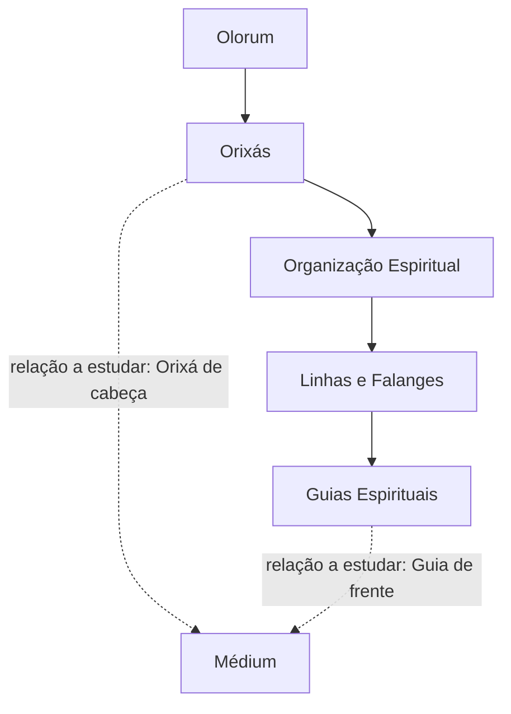

# Mapa Geral da Teologia

> [!warning]
> Este mapa é um **rascunho estrutural de estudo**. Ele não estabelece, por si só, uma hierarquia teológica definitiva. As relações devem ser confirmadas e ajustadas conforme as fontes e os estudos do projeto.

## Relações representadas

- **Linha contínua:** organização conceitual provisória do mapa.
- **Linha tracejada:** relação com o médium que precisa ser estudada e documentada em nota própria.

## Conceitos relacionados

- [[Olorum]]
- [[Orixás]]
- [[Organização Espiritual]]
- [[Linhas e Falanges]]
- [[Guias Espirituais]]
- [[Médium]]
- [[Orixá de Cabeça]]
- [[Guia de Frente]]

## Questões em aberto

- [ ] Qual é a organização adequada entre Orixás, linhas, falanges e falangeiros segundo as fontes adotadas?
- [ ] Como diferenciar estrutura espiritual de relação mediúnica?
- [ ] Como representar Orixá de cabeça sem transformá-lo indevidamente em um nível hierárquico?
- [ ] Como representar Guia de Frente e outras funções espirituais relacionadas ao médium?

## Histórico de revisão

- Mapa inicial criado como estrutura provisória.
