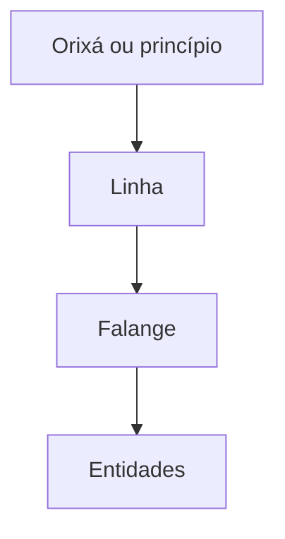

# Falange — termo

> [!abstract] Síntese
> Nota terminológica. Para o estudo conceitual aprofundado, ver [[04 - Linhas e Falanges/Falange|Falange]].
>
> **Falange** é um termo utilizado em muitas sistematizações umbandistas para designar um agrupamento de entidades ou trabalhadores espirituais relacionados por afinidade, campo de atuação, identidade religiosa, função ou direção espiritual. O conceito não possui uma definição única nem uma posição hierárquica universal.

## 1. Por que o termo é importante?

Falange aparece constantemente quando se tenta compreender perguntas como:

- por que entidades diferentes usam o mesmo nome?
- como se organizam os [[Guias Espirituais]]?
- qual a relação entre entidade, linha, Orixá e chefe espiritual?
- “Sete Flechas”, “Tranca-Ruas” ou outro nome designa um espírito individual ou um conjunto de espíritos?

Muitas tradições respondem a essas perguntas por meio do conceito de falange.

## 2. Uma definição didática

Para fins iniciais:

> **Falange é um agrupamento espiritual reconhecido por determinada tradição como reunindo entidades que compartilham algum princípio de identidade, atuação ou direção.**

Essa definição é propositalmente ampla porque os critérios mudam entre autores e terreiros.

## 3. Linha e falange não são necessariamente a mesma coisa

Em muitas escolas, [[04 - Linhas e Falanges/Linhas e Falanges|linha]] é categoria mais ampla e falange uma subdivisão. Em outras, os termos são usados com menos rigor ou com estruturas diferentes.

É possível encontrar modelos como:

Mas também existem sistemas com **legião**, **subfalange**, **povo**, **agrupamento**, **corrente** ou outras categorias.

> [!warning]
> O diagrama acima é um exemplo de modelo, não uma descrição universal do plano espiritual.

## 4. Nome individual ou nome de falange?

Uma das funções teológicas do conceito é explicar por que vários médiuns podem trabalhar com entidades apresentadas pelo mesmo nome.

Determinadas escolas entendem que nomes conhecidos podem funcionar como **nomes falangeiros**, isto é, identidades compartilhadas por vários trabalhadores espirituais.

Outras tradições entendem certos nomes como entidades individuais ou combinam as duas explicações.

Portanto, não é seguro concluir automaticamente que:

- todo nome repetido indica a mesma individualidade;
- todo nome repetido é apenas título;
- toda entidade pertence a uma falange formal.

## 5. Chefe de falange

Algumas doutrinas falam em chefe de falange, entidade que dirige ou representa determinado agrupamento.

Isso também varia. “Chefia” pode significar autoridade espiritual, referência simbólica, coordenação de trabalho ou outra formulação teológica.

Não trataremos chefias como cargos administrativos comprováveis fora da doutrina que os ensina.

## 6. Falangeiro

[[04 - Linhas e Falanges/Falangeiro|Falangeiro]] pode designar integrante, representante ou trabalhador pertencente a uma falange.

Em alguns sistemas o termo possui função precisa; em outros é usado de modo mais genérico.

## 7. Falange e Orixá

Algumas escolas subordinam falanges a linhas relacionadas a [[Orixás]]. Outras apresentam arranjos diferentes.

Assim, frases como “falange X pertence ao Orixá Y” precisam sempre responder:

**segundo qual tradição?**

## 8. Falanges de Caboclos, Pretos-Velhos e Exus

[[Caboclos]], [[Pretos-Velhos]], [[Exus]], [[Pombagiras]] e outras categorias podem ser organizadas em falanges.

A existência de falanges é amplamente encontrada em literatura umbandista, mas os nomes, relações e hierarquias variam intensamente.

Listas encontradas na internet frequentemente misturam modelos de autores diferentes.

## 9. Problema metodológico

Um erro comum é montar uma grande árvore juntando:

- sete linhas de um autor;
- sete falanges de outro;
- legiões de uma terceira escola;
- nomes de entidades de um terreiro específico.

O resultado parece completo, mas pode representar uma cosmologia que **nenhuma tradição realmente ensina**.

Neste projeto, cada modelo será preservado como modelo de sua fonte.

## 10. Síntese

> **Falange é uma categoria de organização espiritual, mas não existe uma única “tabela oficial de falanges da Umbanda”. O conceito só ganha precisão quando sabemos qual escola, autor ou terreiro está sendo utilizado.**

## Relações
- [[04 - Linhas e Falanges/Falangeiro|Falangeiro]]
- [[04 - Linhas e Falanges/Linhas e Falanges|Linhas e Falanges]]
- [[Guias Espirituais]]
- [[Caboclos]]
- [[Pretos-Velhos]]
- [[Exus]]
- [[Pombagiras]]
- [[Orixás]]

## Questões para aprofundamento
- [ ] Comparar sistemas de falanges em diferentes autores.
- [ ] Diferenciar falange, linha, legião, povo e corrente.
- [ ] Mapear quais nomes funcionam como nomes falangeiros em cada fonte.
- [ ] Criar mapas Mermaid separados por escola em vez de um organograma universal.
